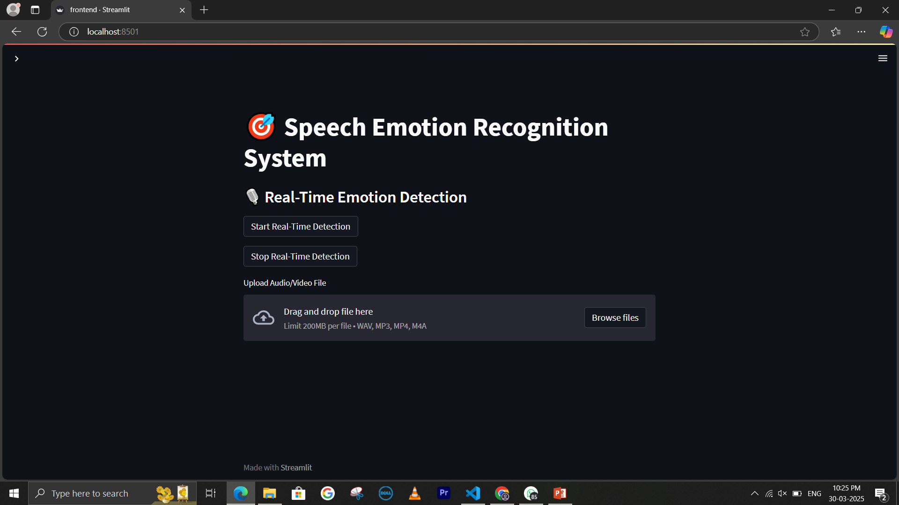
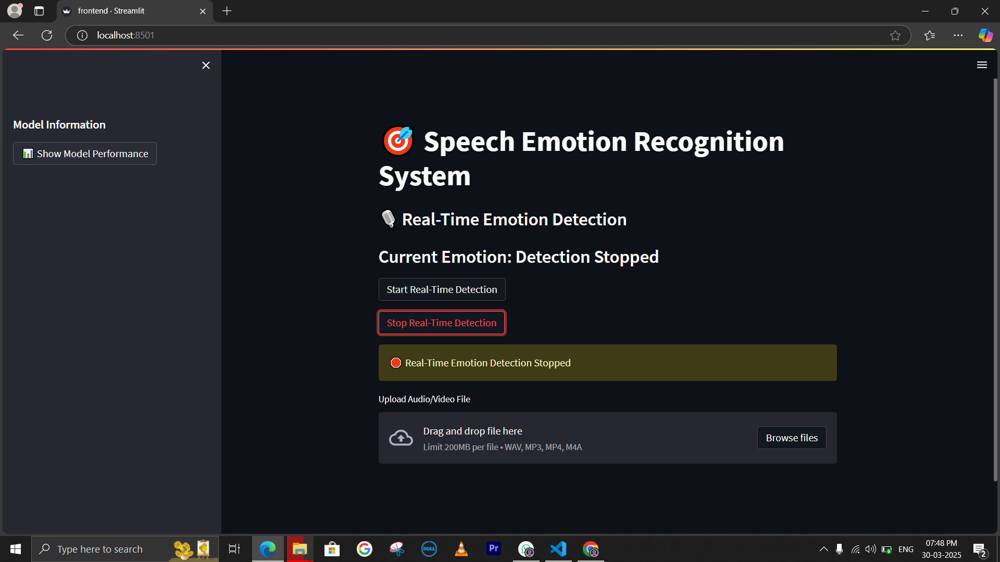
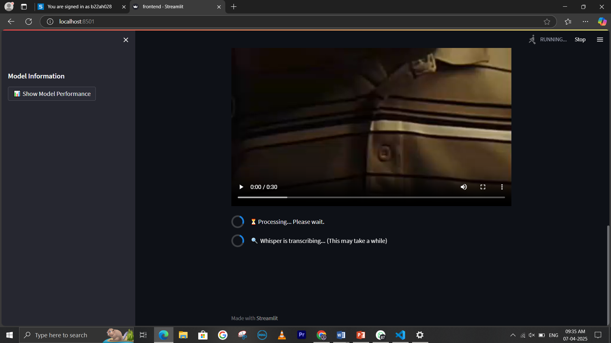

🌟 ✨ Real-Time Speech Emotion Recognition (SER)

A Hybrid Deep Learning + Whisper ASR System

<p align="center">  </p>

```
🎙️ Overview
This project implements a Real-Time Speech Emotion Recognition (SER) system capable of detecting human emotions directly from speech.
It integrates:

🎧 Audio feature extraction
🧠 Hybrid LSTM–GRU deep learning model
🗣️ OpenAI Whisper ASR for speech-to-text
🌐 Streamlit for a clean, interactive UI
The system works with live microphone input or uploaded audio files and supports real-time emotion visualization.

🚀 Key Features
🎤 Live microphone-based emotion detection
📂 Emotion prediction from uploaded audio
🧠 LSTM + GRU + Attention hybrid architecture
🗣️ Whisper ASR for transcription
🧭 Emotion segmentation/timeline visualization
🌐 Streamlit web interface
🔊 Support for multiple datasets, modes, and speakers

🎭 Emotion Classes
Neutral • Happy • Sad • Angry • Fear • Disgust • Surprise • Boredom • Excited

```
<p align="center">  </p>
📂 Sample Output Screenshots
🔹 Main UI
<p align="center">  </p>
🔹 Uploading file
<p align="center">  </p>
🔹 Output Loading
<p align="center">  </p>
🔹 Emotion Prediction Output
<p align="center">  </p>
🔹 Emotion Prediction Output
<p align="center">  </p>
🔹 Emotion Prediction Output
<p align="center">  </p>
🔹 Transcription Using Whisper ASR
<p align="center">  </p>


## 🧩 Project Structure

```
📦 speech-emotion-recognition
│
├── data/                     # Raw datasets & extracted features
├── models/                   # Trained .h5 model files
├── Feature_extraction.py     # Audio preprocessing & feature extraction
├── lstm_gru_model.py         # LSTM + GRU + Attention model
├── Rebuild_model.py          # Load & rebuild trained model
├── frontend.py               # Streamlit frontend
├── utils/                    # Helper functions (segmentation, metrics, preprocessing)
├── images/                   # UI, prediction & output images
├── requirements.txt          # Dependencies
└── README.md                 # Documentation
```

```
🎵 Datasets Used
All audio converted to 16kHz mono WAV.
RAVDESS
CREMA-D
TESS
SAVEE
EMO-DB
Using multiple datasets improves robustness across speakers, accents, and recording conditions.

🛠️ Installation
1️⃣ Clone the Repository
git clone https://github.com/yourusername/speech-emotion-recognition.git
cd speech-emotion-recognition

2️⃣ Install Dependencies
pip install -r requirements.txt

3️⃣ Install FFmpeg
Required for audio conversion and Whisper ASR.

▶️ How to Run
Start the Streamlit app:
streamlit run frontend.py
Visit http://localhost:8501
 in your browser.

You can now:
🎙️ Record live audio
📂 Upload .wav, .mp3, .ogg, etc.
🧠 View real-time emotion prediction
🗣️ See Whisper-generated transcript
📈 Explore emotion segments over time


🔧 Components
LSTM (256 units) — captures long-term emotion cues
GRU (128 → 64 units) — efficient short-term pattern modeling
Multi-Head Attention — focuses on emotion-rich frames
BatchNorm + Dropout — stabilizes and regularizes
Dense + Softmax — final emotion classification

🎚️ Extracted Audio Features
MFCC
Delta & Delta-Delta MFCCs
Chroma
Mel-Spectrogram


These features capture the frequency, energy, harmony, and tone differences that distinguish emotions.

🔮 Future Enhancements
🤖 Facial Emotion Recognition + Audio (Multimodal System)
🗣️ Multilingual Emotion Support
🕸️ Web API (FastAPI/Flask)
📱 Mobile App Deployment
🔍 Transformer-based Speech Models (Wav2Vec2, HuBERT, Whisper Large-V3)

📌 Acknowledgements
TensorFlow / Keras
Librosa
OpenAI Whisper
Streamlit
Scikit-learn
```
